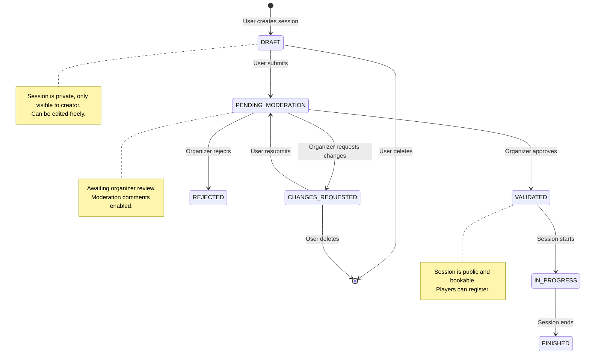
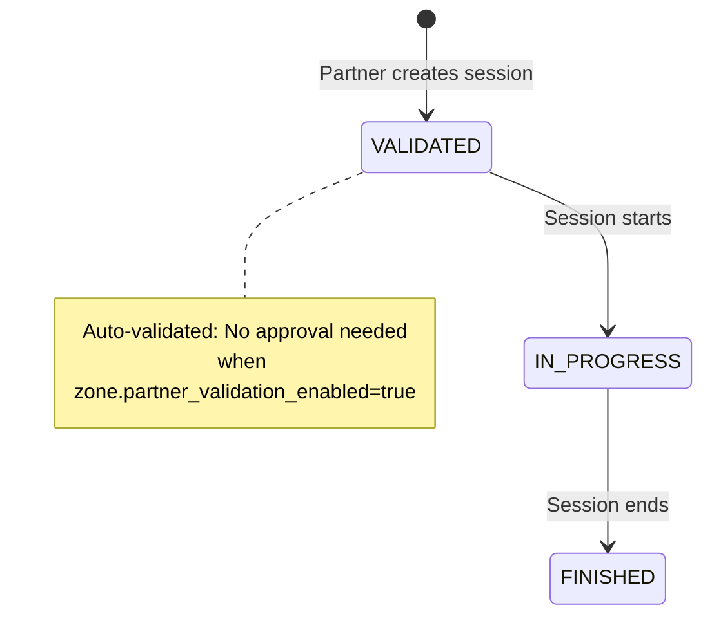
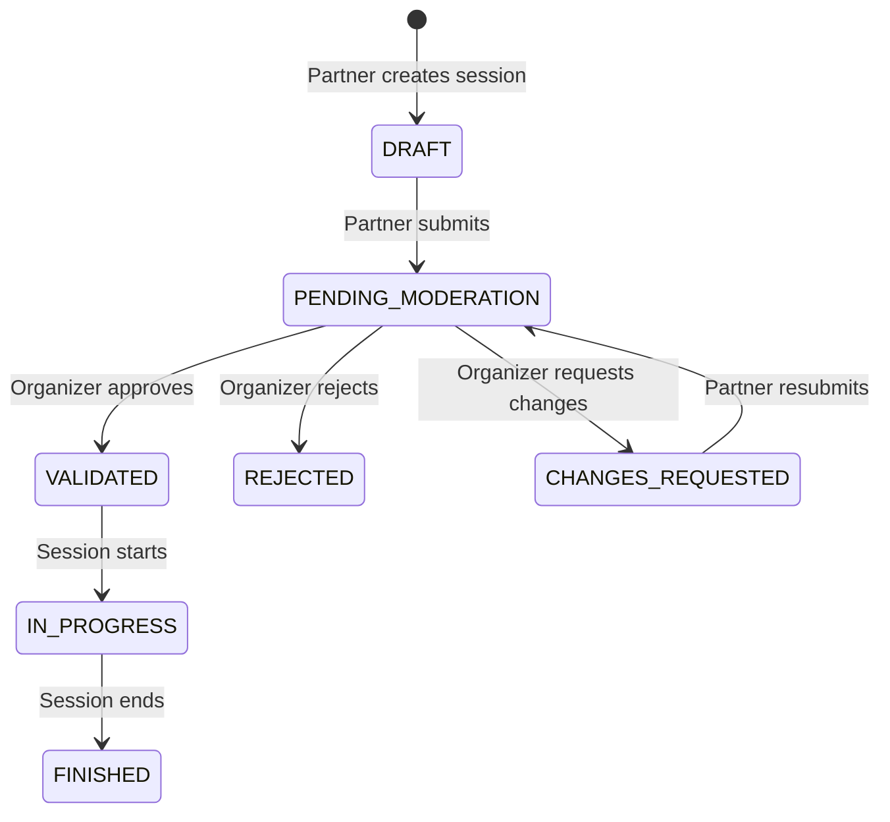
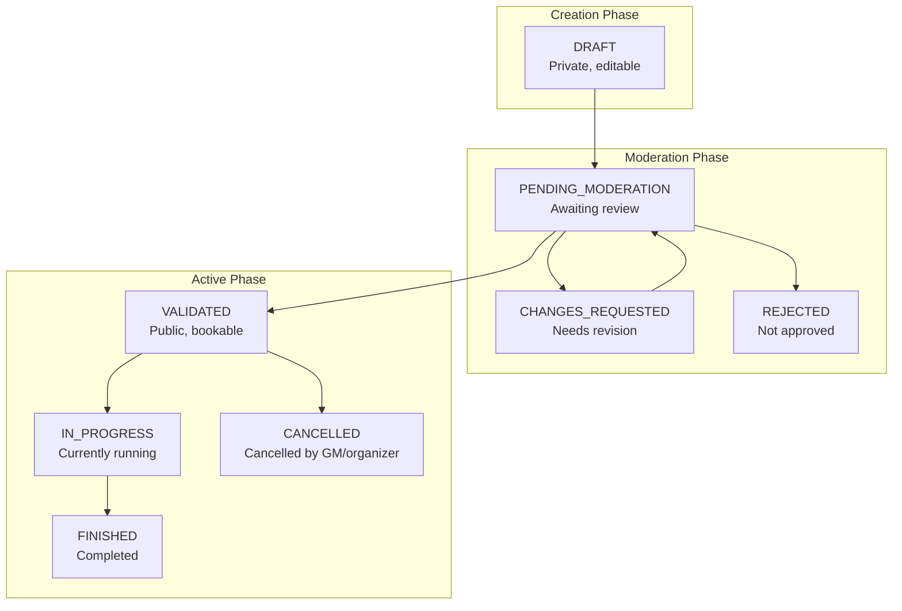
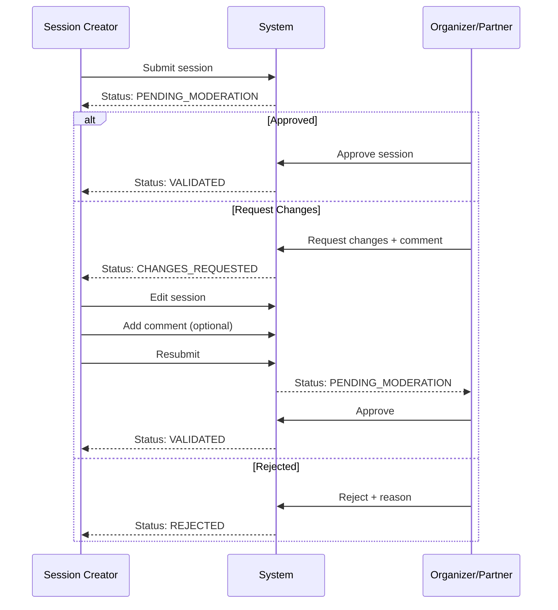

# Session Workflow Documentation

This document describes the session approval workflows for Issue #10 (Partner Zone Management) and #30 (Moderation).

## Table of Contents

1. [Public Session Workflow](#public-session-workflow)
2. [Partner Session Workflow](#partner-session-workflow)
3. [Session Status Overview](#session-status-overview)
4. [Permission Matrix](#permission-matrix)
5. [Moderation Comments Flow](#moderation-comments-flow)

---

## Public Session Workflow

Standard workflow for sessions proposed by players/GMs.

**API Endpoints:**
- `POST /sessions/` - Create session (DRAFT)
- `POST /sessions/{id}/submit` - Submit for review
- `POST /sessions/{id}/moderate` - Approve/reject/request changes
- `POST /sessions/{id}/start` - Start session
- `POST /sessions/{id}/end` - End session

---

## Partner Session Workflow

### With Auto-Validation (zone.partner_validation_enabled = true)

Sessions created by partners in zones with auto-validation enabled skip the moderation process.

**API Endpoints:**
- `POST /partner/sessions` - Create single session (auto-validates)
- `POST /partner/sessions/batch` - Create series (auto-validates)

### Without Auto-Validation (zone.partner_validation_enabled = false)

Sessions require organizer approval like standard sessions.

---

## Session Status Overview

### Status Descriptions

| Status | Description | Visible to Public | Bookable |
|--------|-------------|-------------------|----------|
| DRAFT | Initial state, session is being prepared | No | No |
| PENDING_MODERATION | Submitted for organizer review | No | No |
| CHANGES_REQUESTED | Organizer requested modifications | No | No |
| REJECTED | Session was rejected | No | No |
| VALIDATED | Approved and open for registration | Yes | Yes |
| IN_PROGRESS | Session is currently running | Yes | No |
| FINISHED | Session completed | Yes | No |
| CANCELLED | Session was cancelled | Yes | No |

---

## Permission Matrix

Who can perform which actions:

| Action | Creator | Organizer | Partner (own zone) | Partner (other zone) |
|--------|---------|-----------|-------------------|---------------------|
| Create session | ✓ | ✓ | ✓ | ✗ |
| Edit DRAFT session | ✓ | ✓ | ✓ (own sessions) | ✗ |
| Submit session | ✓ | ✓ | ✓ (own sessions) | ✗ |
| Moderate session | ✗ | ✓ | ✓ (if enabled*) | ✗ |
| Assign table | ✗ | ✓ | ✓ | ✗ |
| Cancel session | ✓ | ✓ | ✓ (own sessions) | ✗ |
| Start/End session | ✓ | ✓ | ✓ (own sessions) | ✗ |

**\*** Partner can moderate sessions if `zone.partner_validation_enabled = true`

---

## Moderation Comments Flow

Communication between session creator and moderators during the review process (#30).

**API Endpoints:**
- `GET /sessions/{id}/comments` - List moderation comments
- `POST /sessions/{id}/comments` - Add comment to moderation thread
