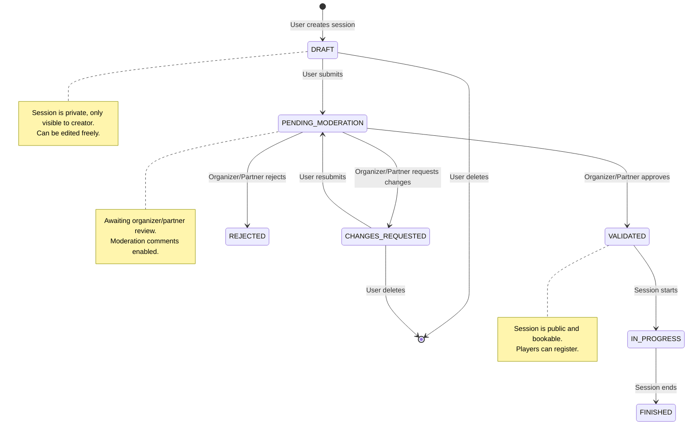
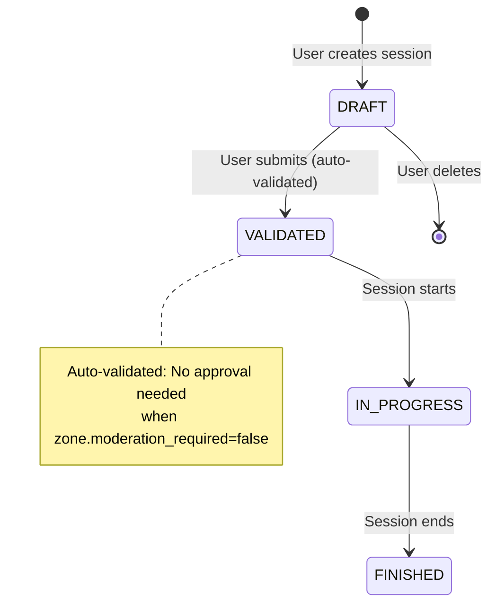
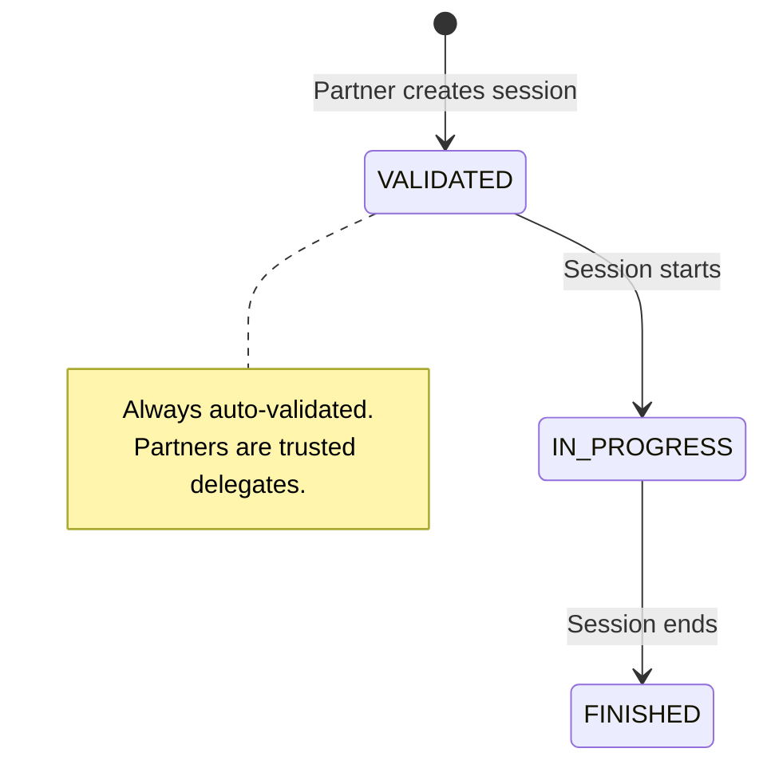
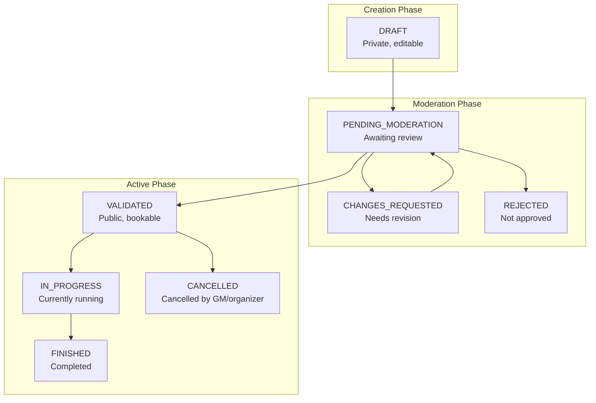
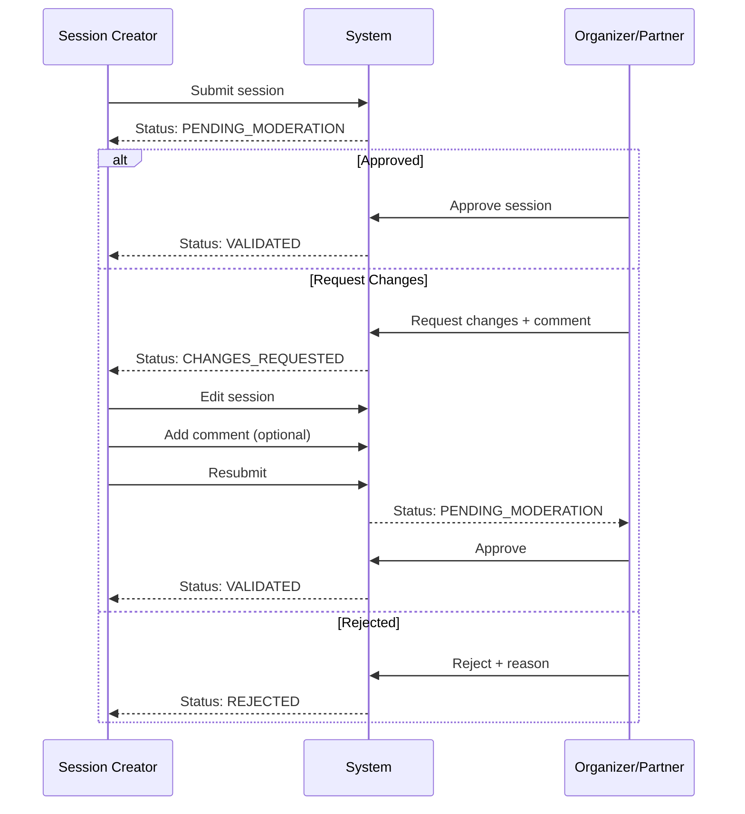

# Session Workflow Documentation

This document describes the session approval workflows for Issue #10 (Partner Zone Management) and #30 (Moderation).

## Table of Contents

1. [Public Session Workflow](#public-session-workflow)
2. [Partner Session Workflow](#partner-session-workflow)
3. [Session Status Overview](#session-status-overview)
4. [Permission Matrix](#permission-matrix)
5. [Zone Moderation Settings](#zone-moderation-settings)
6. [Moderation Comments Flow](#moderation-comments-flow)
7. [Email Notifications](#email-notifications)

---

## Public Session Workflow

Standard workflow for sessions proposed by players/GMs via the public `/sessions/` endpoints.

### With Moderation Required (zone.moderation_required = true, default)

When a zone has moderation enabled (the default), public session proposals go through a review process.

### Without Moderation (zone.moderation_required = false)

When moderation is disabled for a zone, public sessions are auto-validated upon submission.

**API Endpoints:**
- `POST /sessions/` - Create session (DRAFT)
- `POST /sessions/{id}/submit` - Submit for review
- `POST /sessions/{id}/moderate` - Approve/reject/request changes
- `POST /sessions/{id}/start` - Start session
- `POST /sessions/{id}/end` - End session

---

## Partner Session Workflow

Partner sessions (created via `/partner/` endpoints) are **always auto-validated**, regardless of zone settings. This is because partners are trusted delegates who manage their own zones.

**API Endpoints:**
- `POST /partner/sessions` - Create single session (always auto-validates)
- `POST /partner/sessions/batch` - Create series (always auto-validates)

**Note:** The `zone.moderation_required` flag does NOT affect partner sessions. It only controls whether public session proposals (from regular users via `/sessions/` endpoints) require moderation before being validated.

---

## Session Status Overview

### Status Descriptions

| Status | Description | Visible to Public | Bookable |
|--------|-------------|-------------------|----------|
| DRAFT | Initial state, session is being prepared | No | No |
| PENDING_MODERATION | Submitted for organizer review | No | No |
| CHANGES_REQUESTED | Organizer requested modifications | No | No |
| REJECTED | Session was rejected | No | No |
| VALIDATED | Approved and open for registration | Yes | Yes |
| IN_PROGRESS | Session is currently running | Yes | No |
| FINISHED | Session completed | Yes | No |
| CANCELLED | Session was cancelled | Yes | No |

---

## Permission Matrix

Who can perform which actions:

| Action | Creator | Organizer | Partner (own zone) | Partner (other zone) |
|--------|---------|-----------|-------------------|---------------------|
| Create session | ✓ | ✓ | ✓ | ✗ |
| Edit DRAFT session | ✓ | ✓ | ✓ (own sessions) | ✗ |
| Submit session | ✓ | ✓ | ✓ (own sessions) | ✗ |
| Moderate session | ✗ | ✓ | ✓ | ✗ |
| Assign table | ✗ | ✓ | ✓ | ✗ |
| Cancel session | ✓ | ✓ | ✓ (own sessions) | ✗ |
| Start/End session | ✓ | ✓ | ✓ (own sessions) | ✗ |

**Note:** Partners can always moderate public session proposals in their delegated zones, regardless of the `zone.moderation_required` setting. The `moderation_required` flag only controls whether public sessions need moderation at all.

---

## Zone Moderation Settings

Each zone has a `moderation_required` flag that controls how **public** session proposals are handled.

### moderation_required = true (default)

- Public sessions go through DRAFT → PENDING_MODERATION → VALIDATED workflow
- Organizers and partners can approve, reject, or request changes
- Email notifications are sent at each moderation step

### moderation_required = false

- Public sessions are auto-validated upon submission (DRAFT → VALIDATED)
- No moderation step required
- Useful for "free play" zones where anyone can propose a session

### Partner Sessions (always auto-validated)

Partner sessions created via `/partner/sessions` or `/partner/sessions/batch` are **always** auto-validated, regardless of the zone's `moderation_required` setting. This is because:

1. Partners are trusted delegates assigned to manage specific zones
2. Partners should not need to moderate their own sessions
3. It would be redundant to have partners approve sessions they just created

---

## Moderation Comments Flow

Communication between session creator and moderators during the review process (#30).

**API Endpoints:**
- `GET /sessions/{id}/comments` - List moderation comments
- `POST /sessions/{id}/comments` - Add comment to moderation thread

---

## Email Notifications

The system sends email notifications at key moderation events:

| Event | Recipient | Email Subject |
|-------|-----------|---------------|
| Session submitted | Organizers/Partners | "New session pending moderation" |
| Session approved | Session creator | "Your session has been approved" |
| Session rejected | Session creator | "Your session has been rejected" |
| Changes requested | Session creator | "Changes requested for your session" |

All email templates support i18n (English and French).
